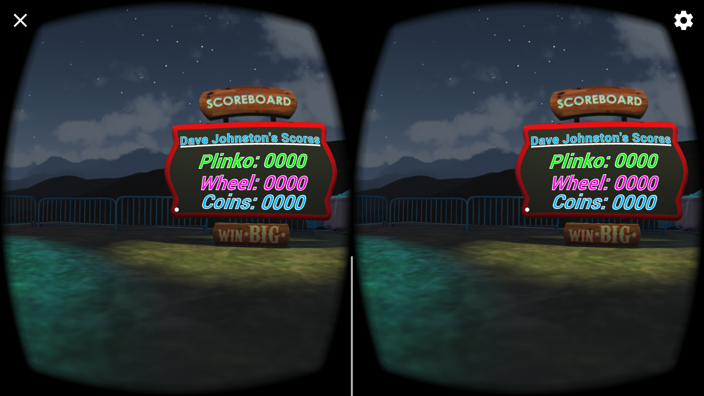
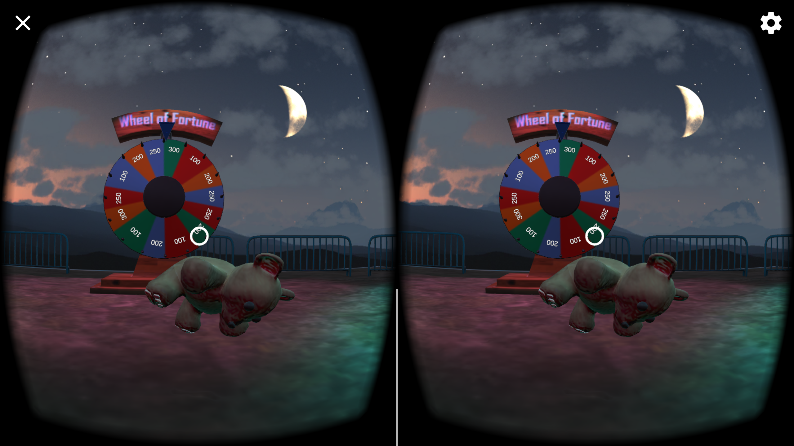

# Carnival
This project is part of the Udacity VR Nanodegree program, and is actually the first project.  The content of the Nanodegree has changed a little bit since I started, and this project was not included when I went through the first part of the course, so I thought I would run through this quick as a refresher, and also because it looked pretty neat.

## Installation
* If you own an Android phone, you can install the app by simply copying the `Carnival.apk` file from the **Builds** directory onto your android device, and installing the apk by clicking on it from the file manager.
* If you own an iPhone, you will need to follow the instructions below for **contributing** to this app, and then switch to the iOS platform in build settings before rebuilding and running on your phone.

## Contributing
You will need to download and install the [Unity Game Engine](https://unity3d.com/), as well as the [Google VR SDK Plugin for Unity](https://developers.google.com/vr/unity/download) to be able to edit this app.  For this app, I used Unity version 5.6.1p2, and GVR version 1.50.0. Next, you will need to clone this GitHub repo, and then open `Night at the Museum` in the Unity editor to begin making modifications to the project.

## Lessons Learned
I since this was a refresher project for me, and was meant to be a learning experience for people who are new to the VR Nanodegree program, I did not really learn anything new.  However, I did enjoy looking at how the carnival games were made and looking through the scripts that were included to make them run properly.  This could be a helpful example for me to use in the future!